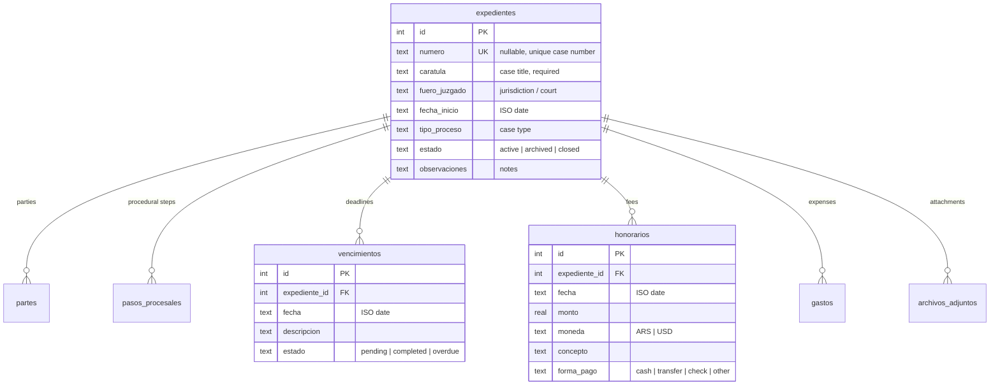

# Architecture

This document describes how Q4 Legal Case Management is structured and the reasoning behind its main design decisions.

## Overview

The application follows a simple three-layer design with strict downward dependencies:

```text
ui/  (Tkinter panels, dialogs, styles)
 │        uses
 ▼
database.py  (SQLite access, schema, migrations, backups)
 │        maps rows to/from
 ▼
models.py  (plain dataclasses)
```

- The UI never writes SQL; it calls functions in `database.py` and receives dataclasses (or plain dicts for the aggregated global views).
- `database.py` never imports UI code.
- `models.py` has no dependencies at all — it is the shared vocabulary between the other two layers.

There is no long-lived database connection: every operation opens a short-lived connection through the `_connect()` context manager, which enables foreign keys, commits on success and rolls back on error. For a single-user local app this is simpler and safer than managing connection state.

## Module responsibilities

| Module | Responsibility |
| --- | --- |
| `main.py` | Windows DPI awareness, `sys.path` setup, DB initialization, main loop |
| `database.py` | Schema creation, migrations, backup rotation, all CRUD and query functions |
| `models.py` | Dataclasses: `Expediente` (case), `Parte` (party), `PasoProcesal` (step), `Vencimiento` (deadline), `Honorario` (fee), `Gasto` (expense), `ArchivoAdjunto` (attachment) |
| `importar_csv.py` | Standalone CLI script for bulk-importing cases |
| `ui/app.py` | Root window, sidebar navigation, lazy panel creation |
| `ui/expedientes.py` | Case list: live filters, column sorting, CRUD entry points |
| `ui/detalle_expediente.py` | Per-case `Toplevel` window with seven tabs |
| `ui/vencimientos.py` | Cross-case deadline board with status filter and quick status change |
| `ui/honorarios.py` | Cross-case fee report with currency filter and totals |
| `ui/dialogs.py` | Generic `FormDialog`, date/amount validation and conversion helpers |
| `ui/styles.py` | ttk theme configuration and the color palette constants |

## Database schema

Seven tables; every child table references `expedientes` with `ON DELETE CASCADE`, so deleting a case removes all of its related records in one statement.



(`partes`, `pasos_procesales`, `gastos` and `archivos_adjuntos` follow the same pattern: an FK to the case plus their own text/date columns.)

Status vocabularies are enforced with SQLite `CHECK` constraints, so invalid values are rejected at the database level, not just in the UI.

## Design decisions

### Dates: ISO in storage, DD/MM/YYYY on screen

All dates are stored as `YYYY-MM-DD` text, which makes SQL `ORDER BY`, `MAX()` and comparisons against today's date work lexicographically. The UI converts to and from `DD/MM/YYYY` at the boundary (`fecha_display` / `fecha_to_iso` in `ui/dialogs.py`). Column sorting in the case list converts display dates back to ISO keys before comparing.

### Accent-insensitive search

`database.py` registers a custom SQLite function `normalize()` (NFKD-decompose, strip combining marks, lowercase) on every connection. Search filters apply it to both the column and the search term, so "Pérez", "PEREZ" and "perez" all match. This keeps the search logic in SQL instead of filtering rows in Python.

### Nullable, unique case numbers

Real-world cases don't always have a court number yet. `numero` is nullable but `UNIQUE`: SQLite allows multiple `NULL`s in a unique column, so any number of unnumbered cases can coexist while duplicates among real numbers are still rejected. Empty strings are converted to `NULL` on write. The UI pre-checks duplicates (`numero_existe`) and, on a hit — or on the `IntegrityError` the constraint raises if a duplicate slips past the pre-check — re-opens the form with the entered data so the user can correct the number instead of losing it.

### Migrations

`init_db()` runs `CREATE TABLE IF NOT EXISTS` for the current schema, then `_migrate_db()` upgrades older databases in place:

1. **Legacy `NOT NULL` case numbers and Spanish status values** — the affected tables are rebuilt with the rename → recreate → copy → drop pattern, translating row values (`activo` → `active`, `pendiente` → `pending`, …) with a `CASE` expression during the copy. Renames run with `PRAGMA legacy_alter_table` so SQLite does not rewrite child-table foreign keys, and each rebuild is wrapped in a transaction so a crash mid-migration rolls back instead of leaving the schema half-converted.
2. **FK repair** — databases migrated by older versions of the app can carry foreign keys pointing at `_expedientes_old`. `_reparar_fks_corruptas()` detects them via `PRAGMA foreign_key_list` and rebuilds each affected child table from its canonical schema.
3. **Free-text value translation** — columns without `CHECK` constraints (`partes.tipo`, `honorarios.forma_pago`) are translated with idempotent `UPDATE … CASE` statements.
4. **Attachment paths** — legacy absolute paths in `archivos_adjuntos.ruta` are rewritten as `<case_id>/<file>`, relative to the `adjuntos/` dir.

All migrations are safe to run repeatedly; a database that is already current passes through untouched.

### Startup backup rotation

Before touching the database, every launch copies `expedientes.db` into `backups/`, rotating `expedientes_backup_1` (newest) through `expedientes_backup_10` (oldest). Combined with the migration system, this means a failed upgrade can always be recovered by restoring the latest backup.

### Attachments are copies, not references

Attaching a file copies it into `adjuntos/<case_id>/` (name collisions get a numeric suffix), so the record stays valid even if the original file moves. Paths are stored relative to the `adjuntos/` dir (`<case_id>/<file>`) and resolved through `ruta_abs_adjunto()`, so moving or restoring the whole app folder never breaks attachments. Writes are ordered to avoid dead records: if the DB insert fails, the copied file is removed; on deletion, the record is removed first and the physical file after — a failure can leave an orphan file, never a record pointing at nothing. Deleting a whole case also removes its attachment folder.

### Portable / frozen execution

`_get_db_path()` and `_get_adjuntos_dir()` resolve paths relative to `sys.executable` when running as a PyInstaller bundle (`sys.frozen`) and relative to the source file otherwise. The database, attachments and backups therefore always sit next to the app, making the whole installation a single portable folder.

## UI patterns

- **Lazy panels** — the sidebar creates each panel (`Cases`, `Deadlines`, `Fees`) on first visit and re-uses it afterwards; switching calls the panel's `refrescar()` so data is always fresh.
- **Generic `FormDialog`** — all create/edit forms are declared as a list of field dicts (`label`, `type`, `options`, `required`, `validate`, `default`). The dialog builds the widgets, validates required fields, dates and amounts, converts dates to ISO, and returns a plain dict in `result`. Adding a field to a form is a one-line change.
- **Modal detail window** — a case opens in a `Toplevel` with a tab per aspect of the case; closing it refreshes the parent list so status or activity changes are reflected immediately.
- **Deadline color coding** — computed at render time from today's date: stored-`overdue` or past-due-`pending` rows render red, `pending` within 5 days yellow, `completed` green. The global board also displays past-due pending deadlines as `overdue` without rewriting the stored status.
